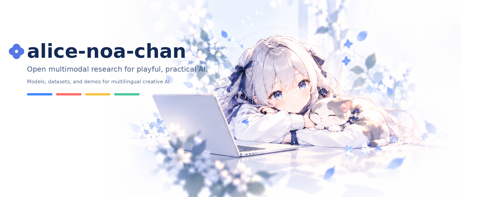

  

 

<h1>Hi, welcome to my little corner of GitHub.</h1>

 

I like making things to see what happens. A passing thought turns into a few lines of code, and sometimes I end up spending far more time on it than I expected.

 

I have a soft spot for language, small models, and ideas that make me wonder, “Could that actually work?” This is where I share some of the things that come out of that curiosity.

 

Feel free to look around. Maybe something here will give you an idea of your own.

 

<a href="https://huggingface.co/alice-noa-chan">Hugging Face ↗</a>

